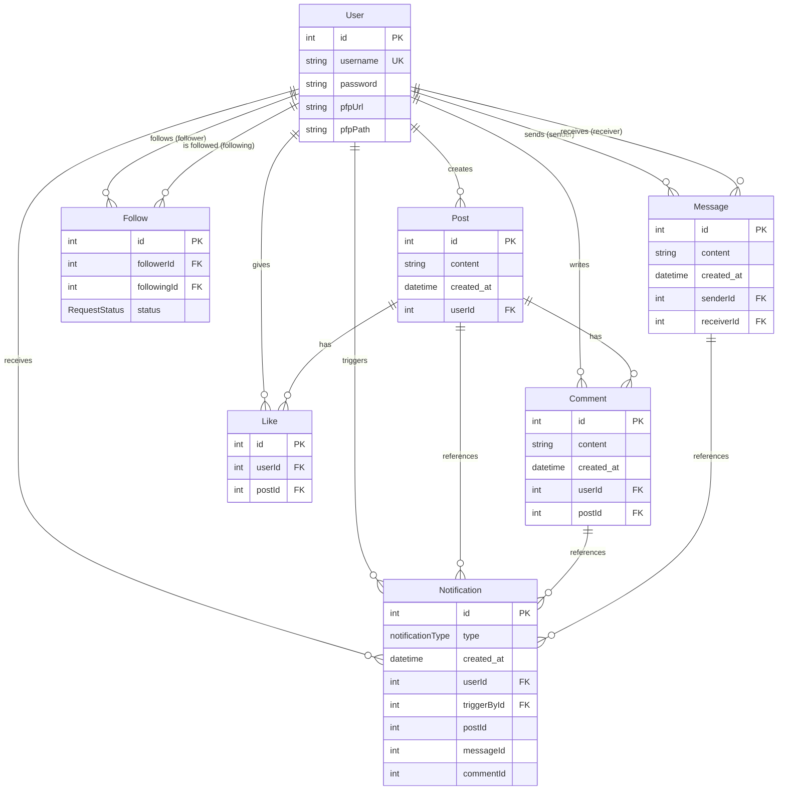

# Database Schema

This document provides a visual representation of the database schema for the Social Media Application.

## Entity Relationship Diagram

## Models Overview

### User
Represents a user account in the system.
- **Primary Key**: `id` (auto-increment)
- **Unique**: `username`
- **Relations**: Creates posts, writes comments, gives likes, follows/followed by users, sends/receives messages, receives/triggers notifications
- **Optional Fields**: `pfpUrl` (profile picture URL), `pfpPath` (profile picture path in storage)

### Post
Represents a user's post on the platform.
- **Primary Key**: `id` (auto-increment)
- **Foreign Key**: `userId` (references User)
- **Relations**: Has many comments and likes
- **Fields**: `content` (text), `created_at` (timestamp)

### Comment
Represents a comment on a post.
- **Primary Key**: `id` (auto-increment)
- **Foreign Keys**: `userId` (references User), `postId` (references Post)
- **Fields**: `content` (text), `created_at` (timestamp)

### Like
Represents a like on a post.
- **Primary Key**: `id` (auto-increment)
- **Foreign Keys**: `userId` (references User), `postId` (references Post)
- **Indexes**: Composite index on `(postId, userId)` for fast lookup

### Follow
Represents follow relationships between users with approval system.
- **Primary Key**: `id` (auto-increment)
- **Foreign Keys**: `followerId` (references User who follows), `followingId` (references User being followed)
- **Unique Constraint**: `(followerId, followingId)` - prevents duplicate follow requests
- **Status**: `PENDING`, `ACCEPTED`, or `REJECTED`
- **Indexes**: Composite index on `(followingId, followerId)`

### Message
Represents direct messages between users.
- **Primary Key**: `id` (auto-increment)
- **Foreign Keys**: `senderId` (references User), `receiverId` (references User)
- **Fields**: `content` (text), `created_at` (timestamp)
- **Note**: Messages can only be sent between users with ACCEPTED follow status (enforced in application logic)

### Notification
Represents notifications for user actions.
- **Primary Key**: `id` (auto-increment)
- **Foreign Keys**: `userId` (user receiving notification), `triggerById` (user who triggered the notification)
- **Optional Foreign Keys**: `postId`, `messageId`, `commentId` (depending on notification type)
- **Types**: 
  - `MESSAGE` - New message received
  - `COMMENT` - Someone commented on your post
  - `LIKE` - Someone liked your post
  - `REQUEST_FOLLOW` - Someone wants to follow you
  - `REQUEST_ACCEPT` - Your follow request was accepted
  - `REQUEST_REJECT` - Your follow request was rejected

## Enums

### RequestStatus
- `PENDING` - Follow request awaiting approval
- `ACCEPTED` - Follow request approved
- `REJECTED` - Follow request denied

### notificationType
- `MESSAGE` - Message notification
- `COMMENT` - Comment notification
- `LIKE` - Like notification
- `REQUEST_FOLLOW` - Follow request notification
- `REQUEST_ACCEPT` - Follow accepted notification
- `REQUEST_REJECT` - Follow rejected notification

## Key Features

1. **Follow System**: Bidirectional follow relationships with approval mechanism (PENDING/ACCEPTED/REJECTED)
2. **Messaging**: Direct messaging between users (restricted to accepted followers)
3. **Social Interactions**: Posts, comments, and likes
4. **Real-time Notifications**: Track all user interactions
5. **Profile Pictures**: Optional profile pictures stored via Supabase storage

## Database Provider

- **PostgreSQL** - Relational database with full ACID compliance
- **Prisma ORM** - Type-safe database client with migrations
